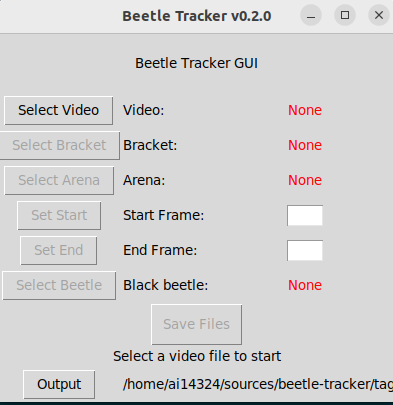

# Beetle Tracker

Beetle Tracker is a small lightweight pair of scripts used to *tag* beetle videos and then *track* them using [idtrackerai](https://idtrackerai.readthedocs.io/en/latest/). Analysis is completed after tracking and various files are generated

## Usage

Beetle tracker runs in two phases. First a video must be tagged manually by a user. This generates a file which is used in the track phase. The tag phase can be run on virtually any machine, but the track phase should be run on a machine with a CUDA runtime.

### Tagging

1. Open the ui with `python tag/GUI_preprocessing.py`
2. Click on the buttons until each requirement is complete. Follow onscreen directions or hints in the console
3. If tracking on a different computer than tagging on, move the video and generated `.json` file to the tracking machine

### Tracking

1. Run the tracker tool `python track/postprocessing.py <filename.json>`

## Install

prereq: python 3 installed (Tested with 3.10)

```bash
$ python --version
Python 3.10.12
```

### Set up the tagging machine

```bash
git clone git@github.com:jsngalloway/beetle-tracker.git
cd beetle-tracker/tag

# Create and activate a python virtual environment for tagging
python3 -m venv ./venv
source ./venv/bin/activate
pip install -r requirements.txt

# Test your installation
python GUI_preprocessing.py

# End your session
deactivate
```

The beetle tracker tagging UI looks like this:



### Set up the tracking machine

Before installation ensure the CUDA runtime is configured. ([nvidia docs](https://docs.nvidia.com/cuda/)) Verify installation with `nvidia-smi` it should output something like:

```
Wed Jan  1 08:46:51 2025
+-----------------------------------------------------------------------------------------+
| NVIDIA-SMI 560.35.05              Driver Version: 560.35.05      CUDA Version: 12.6     |
|-----------------------------------------+------------------------+----------------------+
...
```

Install the requirements for beetle tracking:

```bash
git clone git@github.com:jsngalloway/beetle-tracker.git
cd beetle-tracker/track

# Create and activate a python virtual environment for tracking
python3 -m venv ./venv
source ./venv/bin/activate
pip install -r requirements.txt
```
